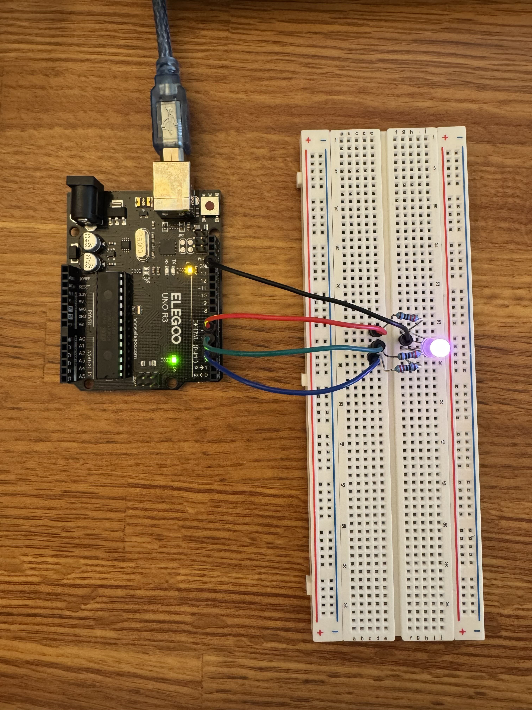

# Lesson 4: RGB LED

This directory contains two RGB LED controllers.

- *sine_led*: simple sine wave going through some of the RGB space)
- *pendulum_led*: jittered sine waves with a more comprehensive exploration of the RGB space like a pendulum.

Photo of the physical implementation:

